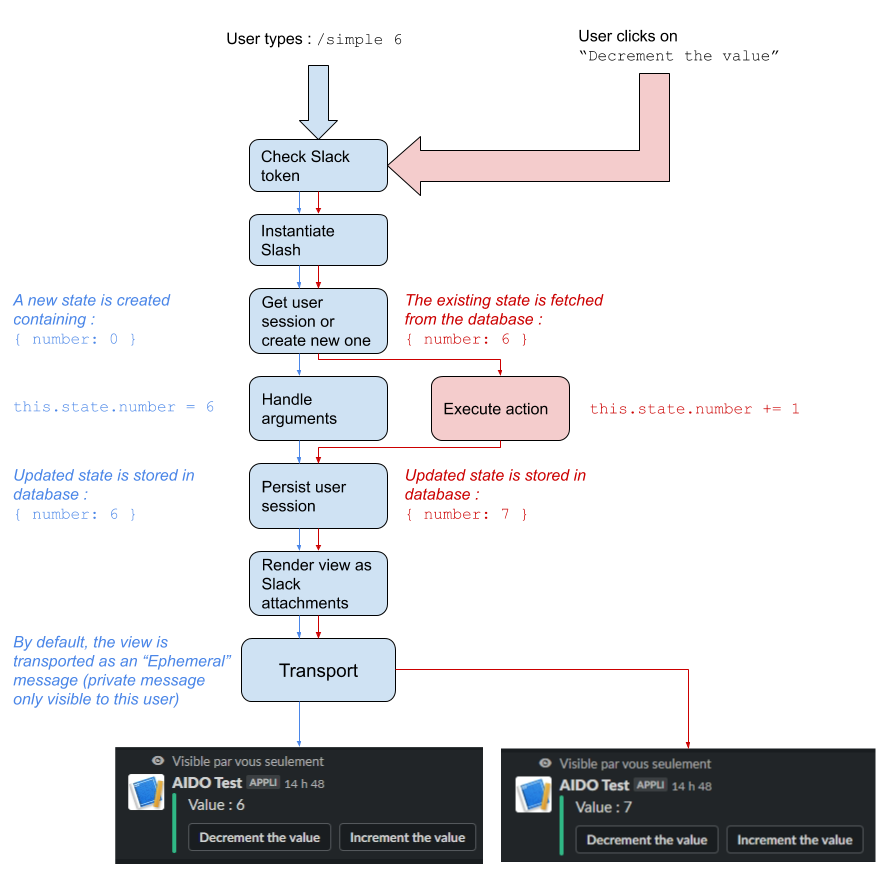

# Aido

_Slack applications made simple !_

Aido is a javascript framework to write Slack applications in a clean and simple way. Its intent is to take away the specificities of the Slack API, and make Slack applications code more like regular old web applications.

You can think of Aido as being a basic Single Page App framework, where your app renders as Slack messages instead of a page in a browser :

- Your views are designed as HTML pages and rendered with [html2slack](https://www.npmjs.com/package/html2slack)
- Your controllers are simple Javascript classes, which can understand Slack interactions such as slash commands, button clicks and dialog inputs
- Your view is updated every time the state is updated
- A basic state management system is provided, which persists user data in an SQLite database (although you are free to use your own data layer)

All you need to worry about is writing your application in HTML & javascript, and Aido does the heavy lifting of communicating to and from Slack. As an added bonus, it includes an interactive configuration tutorial to help you setup your application in your Slack workspace. The configurator will guide you through the installation of your application, the retrieval of all relevant OAuth tokens, the creation of your Slack commands and the attribution of the required OAuth scopes.

If you are looking for the API reference you will find it [right here](docs/API.md).

## A basic example

_For more details please take a look at the [examples folder](/examples)_

Let's create a very simple Slack application : it will display a number, which we can increment or decrement by clicking on two buttons.

First we describe our view using the Pug templating language
```pug
# views/simple.pug
body
  section
    p #{state.number}
  section
    button(name="increment") Add 1
    button(name="decrement") Remove 1
```

Then we create our Javascript program :
```javascript
// index.js
const { Slash } = require('aido')

// This is our controller. In Aido it is called a Slash because it represents one slash command on the Slack workspace
class Simple extends Slash {
  /**
   * Initializes the internal state of the application
   */
  initState() {
    return {
      number: 0
    }
  }

  /**
   * Increments the number. This method will be called by clicking the first button.
   */
  increment() {
    this.state.number += 1
  }

  /**
   * Decrements the number. This method will be called by clicking the second button.
   */
  decrement() {
    this.state.number -= 1
  }
}

// We initialize aido with our Slash
// Because the view is in the views/ folder, it is automatically detected
aido.init({
  slash: { simple: Simple },
})

// Start the aido server on port 3000
aido.start(3000)
```

## Digging deeper

So far, our application works like this :

- The user types `/simple` in Slack
- A view is displayed to them with the number and two buttons
- The user clicks on one of the buttons
- The number is incremented and the view is updated

Let's add a little bit of functionality : we want our user to be able to specify a starting value for the number, for example by typing `/simple 6`. We do this by simply adding a `handleText` method to our Slash :

```javascript
class Simple extends Slash {
  // ...
  handleText() {
    const int = parseInt(this.args(0), 10)
    if (int) {
      this.state.number = int
    }
  }
  // ...
}
```

Below is a schema of the aido lifecycle for a **slash command** (in blue), and an **action** (in red) :



## Setting up your Slack application

Before your application can communicate with Slack, you will have to setup the necessary oauth tokens and authorizations, both on https://api.slack.com/apps and in your Aido configuration. The Aido configuration is the object you provide to the function `aido.init()`. For its full specifications, please refer to the [API reference](docs/API.md).

If you are not sure how to proceed, you can start your application in dev mode (`node index.js dev`) and Aido will provide you with step by step instructions on how to get each token and scope just right.

## Setting up a local tunnel

Because Slack communicates with your aido application through HTTPS webhooks, you will also need to setup a tunnel to a local port. Common services for these purposes include [`localtunnel`](https://localtunnel.github.io/www/) and [`ngrok`](https://ngrok.com/).

You can either configure Aido with an existing tunnel URL, or let it create a free named tunnel on `localtunnel`. Please refer to the [API reference](docs/API.md) for more details.

## API

For further reading, please refer to the [API reference](docs/API.md)
